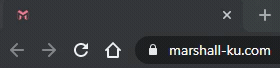

# Add typing animation to title tag



```
typeTitle("title")
typeTitle(["first", "second", "third"])
```

You can use String or Array for your title.

```
typeTitle("title", "type-once")
typeTitle("title", "type-500")
```

If your title is a string, you can change the animation of it.

type-once : literally type once
type-(number) : type the text, and re-type the text after (number)ms
